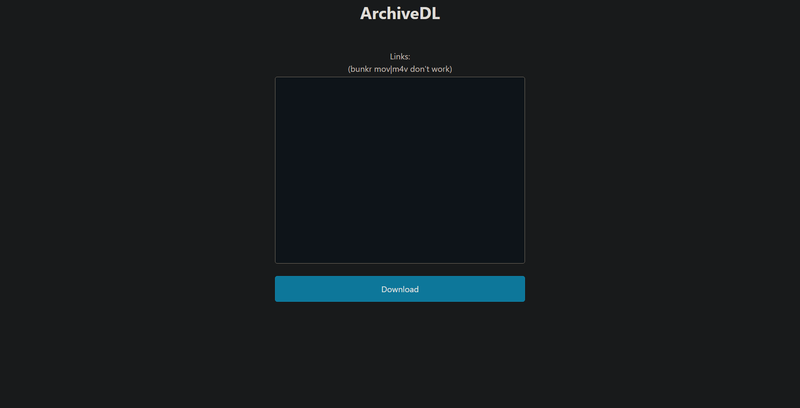

# ArchiveDL

ArchiveDL is an [ai generated](https://chat.openai.com/chat) express webapp written in typescript that acts as a web ui for [gallery-dl](https://github.com/mikf/gallery-dl) (minus the [configuration](https://github.com/mikf/gallery-dl/blob/master/docs/configuration.rst) and [powerful filenaming capabilities](https://github.com/mikf/gallery-dl/blob/master/docs/formatting.md).)

# Installation/Setup

1. Ensure you have [nodejs](https://nodejs.org/en/download/) installed alongside having zip and [gallery-dl](https://github.com/mikf/gallery-dl) installed.
2. Clone this repo.
3. Run `npm install` to install dependencies.
4. Run `npm run build` to compile the project.
5. Run `npm start` to run the server.

The webui will be available at `localhost:8080`

# Usage

Pretty simple, just paste links into the text area and hit download, it will start downloading in the background. (currently no indicator on how long until it's done)



mov and m4v from bunkr links don't donwload using gallery-dl, at least while testing gallery-dl on my system.

If they work on yours just add the extensions in the regex line:

```
const regex = /https:\/\/cdn\d+\.bunkr\.ru\/\S+\.(jpg|jpeg|png|gif|mp4)/g;
```

# Docker

There currently is no dockerfile or image.
